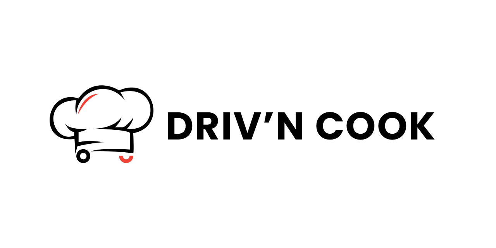

# DRIV'N COOK

Plateforme de gestion dédiée aux franchisés de food trucks. Un espace sécurisé pour gérer votre franchise : suivi des commandes, gestion du parc de camions, approvisionnement en stock, consultation des ventes et accès à tous les services dédiés aux franchisés.

## Stack technique

- **Frontend** : React 19, Next.js 15
- **Backend** : Next.js API Routes
- **Base de données** : Postgress avec Prisma ORM
- **Authentification** : Better-Auth
- **Styling** : Tailwind CSS 4
- **UI Components** : Radix UI, Lucide React
- **Graphiques** : ApexCharts
- **Validation** : React Hook Form avec Zod
- **PDF Generation** : Puppeteer
- **File Upload** : UploadThing

## Fonctionnalités principales

### Pour les administrateurs
- **Dashboard** : Vue d'ensemble des statistiques et métriques
- **Gestion des franchises** : Création, modification et suivi des franchises
- **Gestion des véhicules** : Suivi du parc de camions et maintenance
- **Gestion des produits** : Catalogue et stock des produits
- **Gestion des entrepôts** : Suivi des stocks et approvisionnement
- **Rapports financiers** : Analyses des ventes et revenus
- **Gestion des commandes** : Suivi des commandes en temps réel

### Pour les franchisés
- **Dashboard personnel** : Métriques de performance de la franchise
- **Gestion des commandes** : Suivi et traitement des commandes
- **Gestion des véhicules** : État et maintenance des camions assignés
- **Gestion des produits** : Consultation du catalogue et stock
- **Rapports de ventes** : Analyses de performance commerciale
- **Facturation** : Génération et gestion des factures
- **Support** : Interface de communication avec l'administration

## Structure du projet

```
drivncook/
├── src/
│   ├── app/                   # Pages et API routes (App Router)
│   │   ├── admin/             # Interface administrateur
│   │   ├── franchise/         # Interface franchisé
│   │   └── api/               # API endpoints
│   ├── components/            # Composants React réutilisables
│   ├── hooks/                 # Hooks personnalisés
│   ├── lib/                   # Utilitaires et configurations
│   └── types/                 # Définitions TypeScript
├── prisma/                    # Schema et migrations Prisma
├── public/                    # Assets statiques
└── ...
```